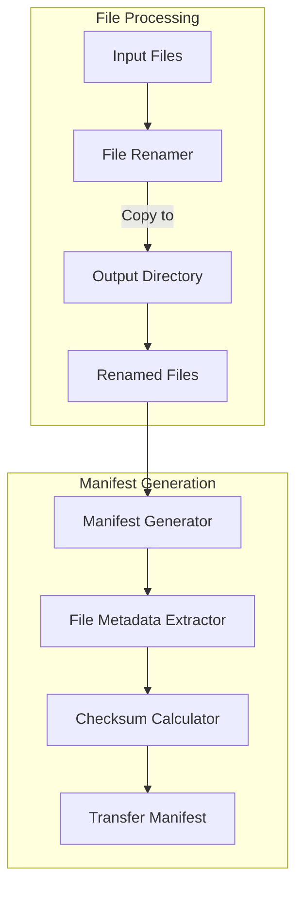
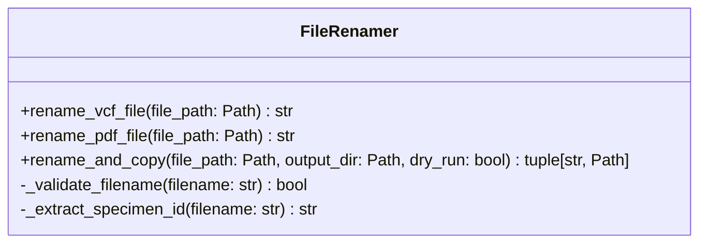
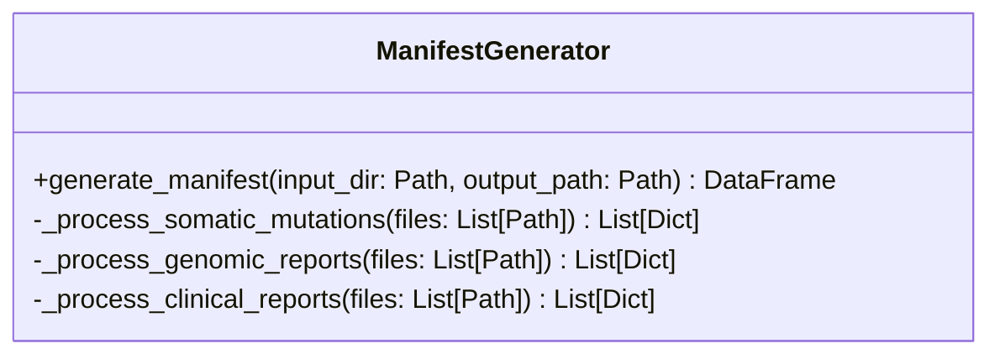
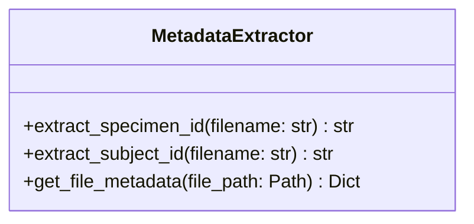
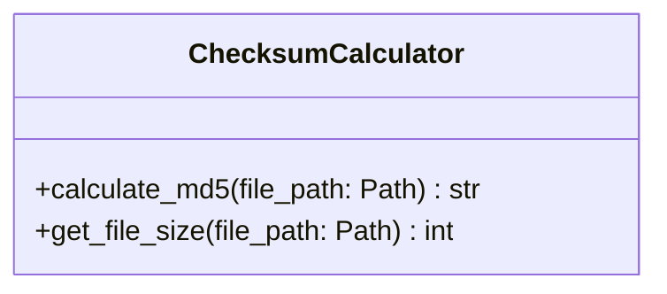
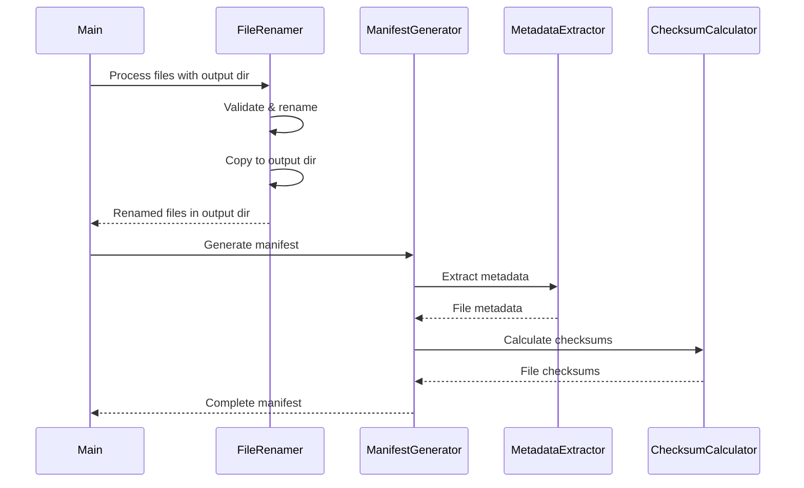

# System Design Document: Data Curation File Management

## Overview of Solution
The solution consists of two main components to handle CMB-derived data files:
1. A file renaming system to standardize file names according to CTDC conventions and copy them to a specified output directory
2. A manifest generation system to create file transfer manifests with required metadata



### Module Tree
```
src/
├── file_management/
│   ├── __init__.py
│   ├── file_renamer.py
│   └── checksum.py
├── manifest/
│   ├── __init__.py
│   ├── manifest_generator.py
│   └── metadata_extractor.py
└── utils/
    ├── __init__.py
    └── file_utils.py
```

## Module Specifications

### 1. file_renamer.py
- **Name**: file_renamer.py
- **Purpose**: Handles the renaming of CMB data files according to CTDC naming conventions and manages file copying to output directory
- **Dependencies**:
  - os
  - pathlib
  - logging
  - re
  - shutil

#### Functions/Classes:


- **FileRenamer**
  - rename_vcf_file(file_path: Path) → str
    - Renames VCF files according to pattern "MSB-XXXXX-XX-somatic-mutations-CTDCv1.vcf"
  - rename_pdf_file(file_path: Path) → str
    - Renames PDF files according to pattern "MSB-XXXXX-XX-genomic-report-CTDCv1.pdf"
  - rename_and_copy(file_path: Path, output_dir: Path, dry_run: bool) → tuple[str, Path]
    - Renames a file according to CTDC conventions and copies it to the output directory
    - Returns tuple of (new_filename, new_file_path)
    - If dry_run is True, only returns the new name without copying

**Existing or New**: New module

### 2. manifest_generator.py
- **Name**: manifest_generator.py
- **Purpose**: Generates file transfer manifests with required metadata for each file type
- **Dependencies**:
  - pandas
  - pathlib
  - metadata_extractor
  - checksum

#### Functions/Classes:


- **ManifestGenerator**
  - generate_manifest(input_dir: Path, output_path: Path) → DataFrame
    - Creates transfer manifest for all files with required metadata fields

**Existing or New**: New module

### 3. metadata_extractor.py
- **Name**: metadata_extractor.py
- **Purpose**: Extracts and validates metadata from filenames and file contents
- **Dependencies**:
  - pathlib
  - re

#### Functions/Classes:


- **MetadataExtractor**
  - extract_specimen_id(filename: str) → str
    - Extracts specimen ID from filename (first 13 characters)
  - get_file_metadata(file_path: Path) → Dict
    - Returns complete metadata dictionary for a file

**Existing or New**: New module

### 4. checksum.py
- **Name**: checksum.py
- **Purpose**: Calculates file checksums and sizes
- **Dependencies**:
  - hashlib
  - pathlib

#### Functions/Classes:


- **ChecksumCalculator**
  - calculate_md5(file_path: Path) → str
    - Calculates MD5 checksum of file
  - get_file_size(file_path: Path) → int
    - Returns file size in bytes

**Existing or New**: New module

## Module Interaction Diagram


## Error Handling and Logging
- All modules will use Python's built-in logging module
- File operations will have proper try-except blocks
- Input validation for filenames and metadata
- Checksum verification after file operations
- Manifest data validation before writing

## Best Practices
- Type hints used throughout the codebase
- PEP 8 style guidelines followed
- Docstrings for all modules, classes, and functions
- Unit tests for each module
- Configuration stored in separate config files
- Modular design for easy maintenance and extension
